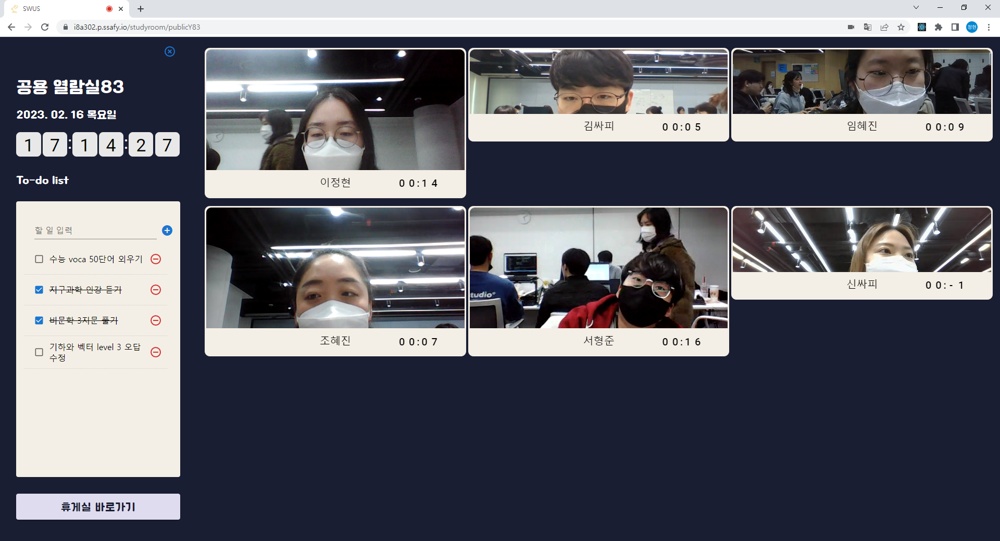
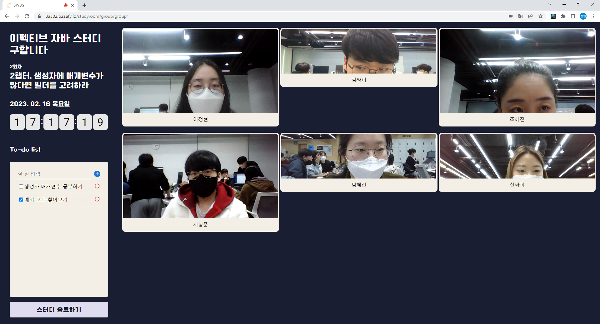
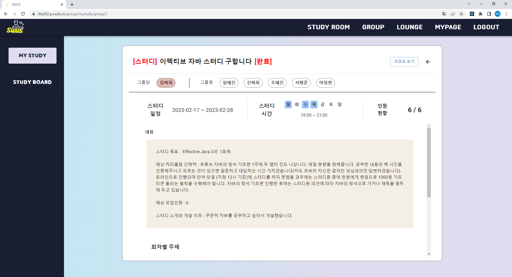
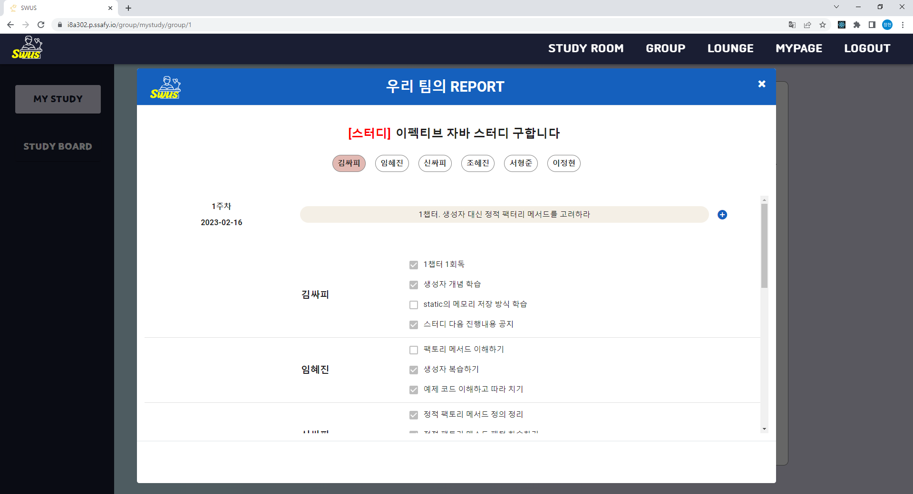
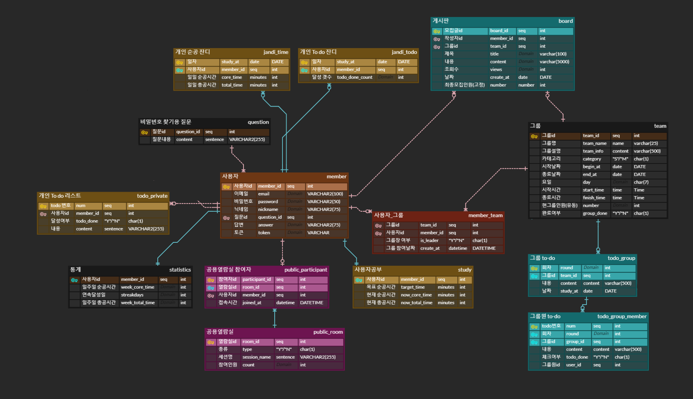
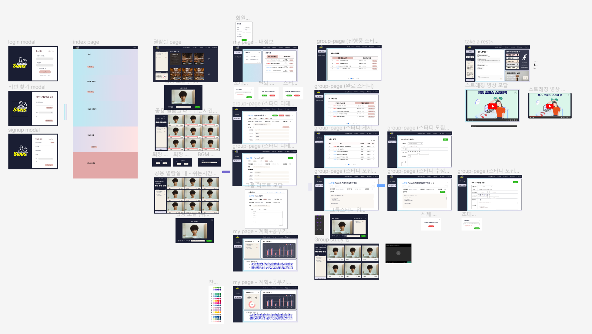
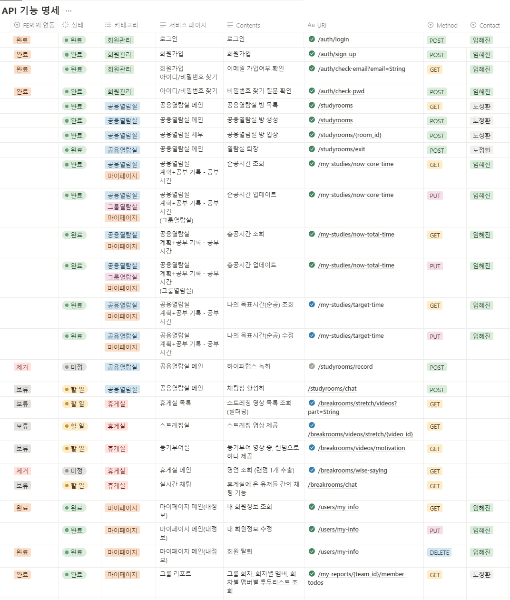
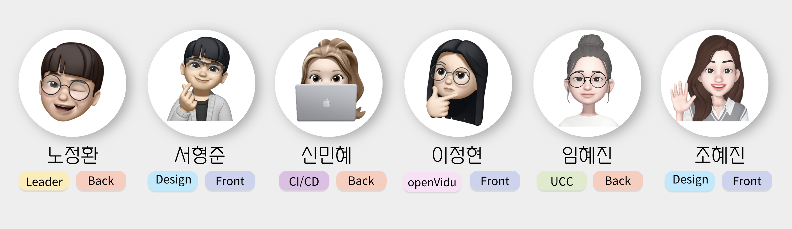

# Study With Us

## 1. Overview✨

**서비스 소개**

카페에 직접 가서 공부하기는 부담스럽고 집에서 혼자 공부하기에는 집중이 안되는 당신!

오프라인으로 친구들과 같이 모여서 공부하기가 힘든 당신!

온라인에서 다른 사람들과 모여서 같이 공부하고 집중력도 향상시키는 Study With Us 에서 같이 공부해보세요!

**기획 배경**

펜데믹 이후 많은 사람들이 오프라인으로 독서실이나 카페에 가서 공부하기 부담을 느끼고 있습니다. Study with Us (SWUS) 는 이러한 부담감을 덜어주기 위함에 집중했습니다. 또한 다른 사람들이 공부하는 모습과 그 날의 학습 시간들을 보면서 서로 자극을 주며 같이 집중할 수 있게 해주는 러닝 메이트의 역할을 해주고 싶었습니다.

집에서 혼자 하면 공부하면 집중되지 않은 많은 사람들이 밖에 나가지 않고 다른 사람들과 같이 공부하고 있다는 느낌을 주어 몰입감있는 공부 환경을 만들고자 했습니다.

**타겟**

1. 카페나 독서실 같은 분위기에서 공부하고 싶은 사람
2. 집에서 혼자 공부하면 잘 집중하지 못하는 사람
3. 자신의 공부 기록을 정리해서 보고 싶은 사람

## 2. Study With Us 서비스 화면 

**메인 페이지**

**공용 열람실**

**마이 페이지(기록)**

.png)

.png)

**그룹 열람실**

**그룹 정보 & 리포트**

**휴게실**

## 3. 주요기능 ✨

1. 공용 열람실

   - WebRTC의 기능을 활용하여 다른 사람들이 공부하고 있는 모습을 실시간으로 확인할 수 있고 스스로 공부하는 모습도 공유할 수 있다.
   - 개개인이 그 날 공부한 시간이 화상 화면에 직접 표시되고 모든 이용자들이 실시간으로 확인할 수 있다.
   - 그날 스스로 할 공부나 목표를 todo-list 형식으로 직접 입력하고 완료된 항목을 체크하여 그 날의 공부 계획을 관리할 수 있다.
      

2. 그룹 스터디

   - 직접 게시글을 작성하여 일정 및 모임 시간을 지정하고 같은 목적을 가진 사람들을 모아 같이 스터디를 할 수 있다.
   - 매 회차마다 해야할 대 주제를 정해서 공유할 수 있고 그룹원들은 해당 회차별로 자신들이 해야할 일들을 직접 기록 및 관리할 수 있다.
   - 해당 회차가 끝나면 그 회차의 날짜와 그룹원들의 달성 목록들이 리포트에 자동으로 작성되고 직접 확인하여 달성도를 확인할 수 있다.
      

3. 마이 페이지

   - 그 날의 목표 공부 시간과 해야할 일 들을 직접 설정할 수 있고 진척도 또한 확인할 수 있다.
   - 일주일 동안의 목표 공부 시간과 그에 따른 달성 시간을 그래프로 확인할 수 있다.
   - 1년간의 공부 기록을 달성한 해야할 일 들의 개수 혹은 공부 시간을 기준으로 확인할 수 있다.
      

4. 휴게실
   - 자신에게 피곤한 부위에 따른 추천 운동 영상을 제공해준다.
   - 공부를 하다 지쳤을때 동기를 부여해 줄 수 있는 영상을 무작위로 추천해준다.
   - 계속 휴게실에 머물러있는 것을 방지하기 위해 30분이 지나면 자동으로 공용 열람실의 메인 페이지로 보내준다.

## 4. 기획

### ERD

### Figma

### API 기능 명세

## 5. 개발 환경과 기술 스택 🖥️

- **Server**
  - AWS EC2
  - OS: Ubuntu 22.04.1 LTS
- **IDE**
  - Backend: IntelliJ IDEA 2022.1.3
  - Frontend: Visual Studio Code 1.75.1
- **DevOps**
  - Nginx: nginx/1.18.0 (Ubuntu)
  - Jenkins 2.375.2
  - Docker version 23.0.0
- **SSL**
  - letsencrypt
  - certbot 0.40.0
- **DataBase**
  - MySQL 8.0.32
- **Backend**
  - Java OpenJDK 1.11.0
  - Springboot Gradle 2.7.8
  - Spring Data JPA
  - Lombok
  - Junit5
- **Frontend**
  - NodeJS 18.13.0
  - npm 8.19.3
  - react 18.12.0
  - redux 4.2.0
  - material ui
- **Others**
  - OpenVidu 2.25.0
  - Google Gmail SMTP
- **협업툴**
  - 형상 관리: GitLab
  - 이슈 관리: Jira
  - 커뮤니케이션: Notion, MatterMost

## 6. 프로젝트 진행

### Jira 👨‍👩‍👧

협업 및 일정 관리를 위해 Jira를 사용하였다. 매주 월요일 오전 스크럼에서 지난 한주간 있었던 일들에 대해 간단하게 서로 공유하고 이번 한 주동안의 계획과 일정에 대해 공유하였습니다. 그렇게 공유된 계획에 따라 서로의 일정을 조율하고 그 조율을 바탕으로 이슈들을 등록하고 스프린트를 생성하였다. 스프린트는 일주일 단위로 진행하였다.

- Epic: Frontend, Backend에서 맡은 개발 페이지, 그리고 그 외의 문서 작업들을 기준으로 나누어 구성하였다.
- Story: 코드와 직접적인 연관이 없는 세부 과제들로 작성하였다.
- Task: 코드 작업과 직접적인 연관이 있는 세부 과제들로 작성하였다.

### Git Flow 👨‍👩‍👧

- master 브랜치에서 시작
- 동일한 브랜치를 develop에도 생성
- 동일한 브랜치를 FE와 BE에도 생성
- 개발 진행 중 기능 구현이 필요한 경우 각자 FE/BE 브랜치에서 feature브랜치를 하나 생성해서 각자 맡은 기능 구현하였고,
- 완료된 feature 브랜치는 검토를 통해 FE/BE 브랜치에 merge
- 모든 기능이 완료되면 develop 브랜치에서 검토후 master 브랜치로 보냈습니다.
- master로 보낸 feature 브랜치는 삭제하였습니다.

  | 커밋 유형 | 의미                                      |
  | --------- | ----------------------------------------- |
  | FEAT      | 새로운 기능 추가                          |
  | DOCS      | 문서 수정                                 |
  | REFACTOR  | 코드 리팩토링                             |
  | DESIGN    | CSS 등 사용자 UI 디자인 변경              |
  | COMMENT   | 필요한 주석 추가 및 변경                  |
  | BUILD     | 배포, Docker, Jenkins등 파일 수정 및 추가 |

### Notion 👨‍👩‍👧

서로에게 공유되면 좋은 자료, 회의록, 그리고 명세서들을 모아 관리하였다. 컨벤션 규칙 및 깃 브랜치 전략, 그라운드 룰과 같이 모두가 지켜야하는 중요한 사항들은 노션 상단에 기록하여 접근하기 쉽게 관리하였다. 그리고 큰 일정들도 같이 적어 관리하였다.

## 7. 팀원 ❤️

