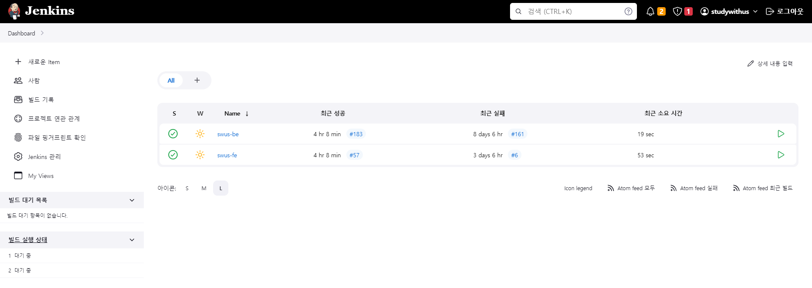
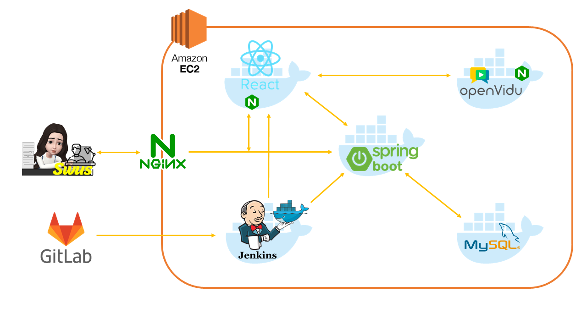

# [Final] How to set EC2 & CI/CD

- Written By @ShinMinhye  

 

## **🖥️ 개발 환경과 기술스택**

|개발환경|기술스택|
|:--------------------:|:-------------------------|
| **Server** | - AWS EC2 - OS: Ubuntu 22.04.1 LTS |
| **IDE** | - Backend: IntelliJ IDEA 2022.1.3 - Frontend: Visual Studio Code 1.75.1 |
| **DevOps** | - GitLab - Nginx: nginx/1.18.0 (Ubuntu) - Jenkins 2.375.2 - Docker version 23.0.0 |
| **SSL** | - letsencrypt - certbot 0.40.0 |
| **DataBase** | - MySQL 8.0.32 |
| **Backend** | - Java OpenJDK 1.11.0 - Springboot Gradle 2.7.8 - Spring Data JPA - Lombok - Junit5 |
| **Frontend** | - NodeJS 18.13.0 - npm 8.19.3 - react 18.12.0 - redux 4.2.0 - material ui 5.11.8 |
| **Others** | - OpenVidu 2.25.0 - Google Gmail SMTP |
  
 

## ✨ 배포

 

## ✨ 서비스 아키텍쳐

 

## ✨ 포팅 메뉴얼

프로젝트 관련 세부사항들을 총 정리해 작성했습니다.  
https://lab.ssafy.com/s08-webmobile1-sub2/S08P12A302/-/blob/DEV/exec/StudyWithUs_%ED%8F%AC%ED%8C%85%EB%A9%94%EB%89%B4%EC%96%BC.pdf