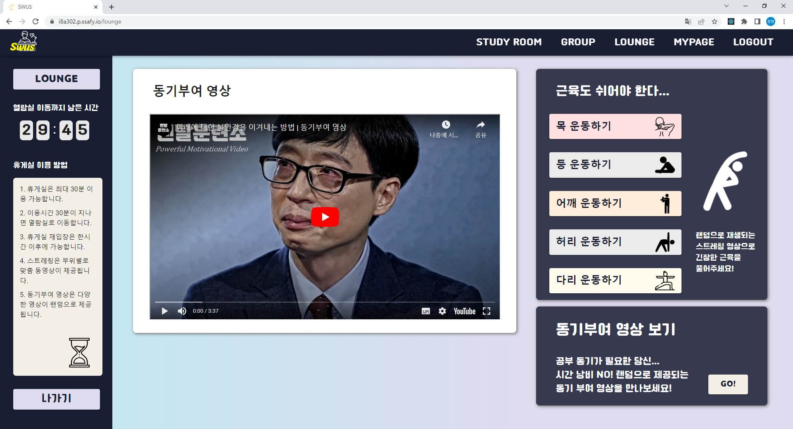
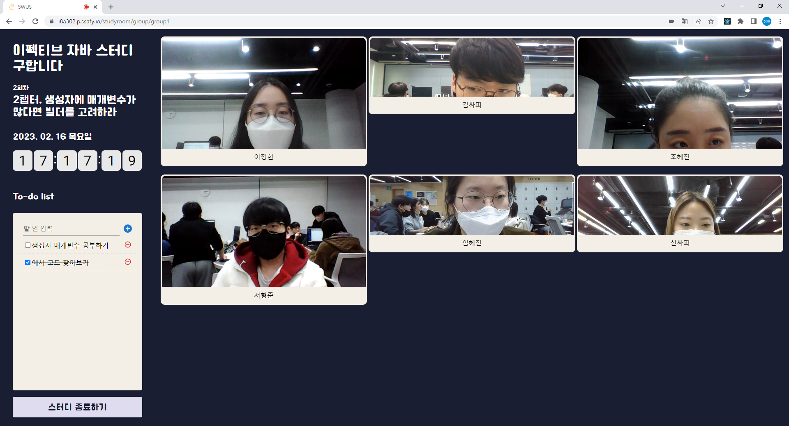
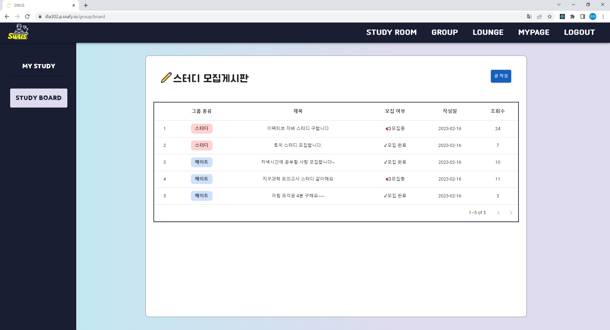
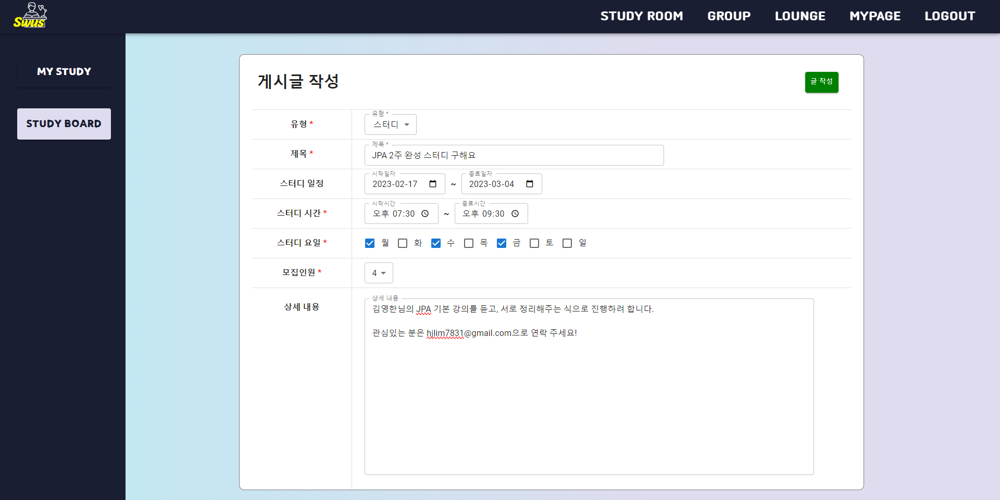

# 🎞 시연 시나리오

- Written By @ShinMinhye  

프로젝트에 대한 전반적인 주요 기능을 보여주는 시나리오를 작성했습니다.

 

## ✨ 메인페이지

 

## ✨ 공용열람실

- WebRTC의 기능을 활용하여 다른 사람들이 공부하고 있는 모습을 실시간으로 확인할 수 있고 스스로 공부하는 모습도 공유할 수 있다.
- 그날 스스로 할 공부나 목표를 todo-list 형식으로 직접 입력하고 완료된 항목을 체크하여 그 날의 공부 계획을 관리할 수 있다.
- 개개인이 그 날 공부한 시간이 화상 화면에 직접 표시되고 모든 이용자들이 실시간으로 확인할 수 있다.

 

## ✨ 휴게실

- 자신에게 피곤한 부위에 따른 추천 운동 영상을 제공해준다.
- 공부를 하다 지쳤을때 동기를 부여해 줄 수 있는 영상을 무작위로 추천해준다.
- 계속 휴게실에 머물러있는 것을 방지하기 위해 30분이 지나면 자동으로 공용 열람실의 메인 페이지로 보내준다.

 

## ✨ 마이페이지

- 그 날의 목표 공부 시간과 해야할 일 들을 직접 설정할 수 있고 진척도 또한 확인할 수 있다.
- 일주일 동안의 목표 공부 시간과 그에 따른 달성 시간을 그래프로 확인할 수 있다.
- 1년간의 공부 기록을 달성한 해야할 일 들의 개수 혹은 공부 시간을 기준으로 확인할 수 있다.

.png)

.png)

 

## ✨ 스터디 그룹

### 👨‍👧‍👧 그룹열람실

- 직접 게시글을 작성하여 일정 및 모임 시간을 지정하고 같은 목적을 가진 사람들을 모아 같이 스터디를 할 수 있다.
- 매 회차마다 해야할 대 주제를 정해서 공유할 수 있고 그룹원들은 해당 회차별로 자신들이 해야할 일들을 직접 기록 및 관리할 수 있다.
- 해당 회차가 끝나면 그 회차의 날짜와 그룹원들의 달성 목록들이 리포트에 자동으로 작성되고 직접 확인하여 달성도를 확인할 수 있다.

### 👨‍👧‍👧 그룹정보

### 👨‍👧‍👧 그룹리포트

### 👨‍👧‍👧 스터디 모집게시판

